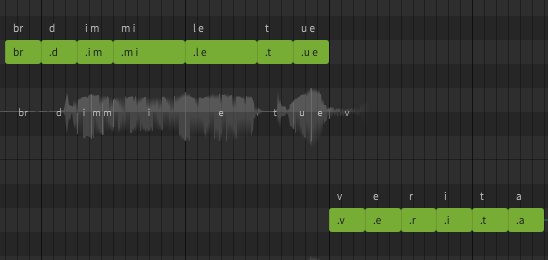

# SynthV-to-Language-Phoneme Plugin
**Synthesizer V Dreamtonics: Language Phoneme Converter**

## INTRODUCTION

Hello everyone, I have developed this script to allow customization of the current dictionary system, which has limitations when handling multilingual words.  
The script requires two supporting files for each language:
- `{language}.dic`
- `{language}-dream.dic`

In this case, I have created files for the Italian language, namely `IT.dic` and `IT-dream.dic`.

## INSTALLATION

Copy .lua script inside script folders.
Create a subdirectory "languages" and put inside it the .dic files.

NOTES: Check the script directory inside the script.
Current is set with "Documenti" name, if it's not working change it accordingly your path.

## HOW IT WORKS

### IT.DIC
This file contains the "conversion rules" for transforming words into IPA (International Phonetic Alphabet).  
The structure is divided as follows:

> //{NOME_REGOLA}  {SIMBOLO_IPA},{SIMBOLO_LINGUA_CORRENTE}
> 
> {REGEX LUA SORGENTE},{REGEX LUA DESTINAZIUONE},{ECCEZIONE_1|ECCEZIONE_2|...}

Below is an example for the Italian "open O" sound, with two underlying conversion rules:

> //O_APERTA ɔ,o
>
> (.-)uo(.*),%1uɔ%2,liquore|languore
> 
> (.-)od(.?),%1ɔd%2,rod(.-)|erod(.-)|corrod(.-)|coda
> 
> (.-)o([bcdfhjkglmnpqrstvwxyz])([aeɛijouʊ])([aeɛijouʊ])(.*),%1ɔ%2%3%4%5,incrocio

In the first case, we are stating:
* Check if the word contains "uo" between two groups of any letters:
    * `(.-)uo(.*)`
* Convert it to "uɔ" while preserving the other letters:
    * `%1uɔ%2`
* Do not apply this rule if the primary word is "liquore" or "languore".

In the second case, we are stating:
* Check if the word ends with "od" followed by exactly one additional letter:
    * `(.-)od(.?)`
* Convert it to "ɔd" while preserving the other letters:
    * `%1ɔd%2`
* Do not apply this rule if the word begins with "rod-", "erod-", "corrod-", or is the word "coda."

In the third case, we are stating:
* Check if the word contains "o" followed by any of the consonants "bcdfhjkglmnpqrstvwxyz" and two vowels:
    * `(.-)o([bcdfhjkglmnpqrstvwxyz])([aeɛijouʊ])([aeɛijouʊ])(.*)`
* Convert it to "ɔ" while preserving the other letters:
    * `%1ɔ%2%3%4%5`
* Do not apply this rule if the word is "incrocio."

### IT-Dream.DIC
This file contains the "conversion rules" for transforming words from IPA to Synthesizer V phonemes.  
The structure is simpler than the previous one:

> {FONEMA IPA},{FONEMA SYNTH 1}:{LINGUA SYNTH 1}|{FONEMA SYNTH 2}:{LINGUA SYNTH 2}

Below is an example:

> ʧ,ch:ING|ch:SPA

In this case, the phoneme `ʧ` can be converted:
* into `ch` for English
* into `ch` for Spanish

## USAGE

The script should be used by:
* Selecting a group of notes

* Choosing the conversion language (currently only Italian is supported)

As you can see, the script will transform this group of notes:

into this:

Follows an example log

>[Logger Thu Oct 24 09:30:42 2024] INFO  - OS: Windows
> 
>[Logger Thu Oct 24 09:30:43 2024] INFO  - Language: IT
>
>[Logger Thu Oct 24 09:30:43 2024] INFO  - Start processing rules
>
>[Logger Thu Oct 24 09:30:43 2024] INFO  - Open IPA rule file C:\Users\ferra\OneDrive\Documenti\Dreamtonics\Synthesizer V Studio\scripts\Utilities\languages\IT.dic
>[Logger Thu Oct 24 09:30:43 2024] INFO  - Open dream rule file C:\Users\ferra\OneDrive\Documenti\Dreamtonics\Synthesizer V Studio\scripts\Utilities\languages\IT-dream.dic
>
>[Logger Thu Oct 24 09:30:43 2024] INFO  - End processing rules
>
>[Logger Thu Oct 24 09:30:43 2024] INFO  - Start processing notes
>
>[Logger Thu Oct 24 09:30:43 2024] INFO  - Lyric dim --> IPA: dim --> Dream: 1: {1: d 2: SPA 3: d } 2: {1: i m 2: CAN 3: im }
>
>[Logger Thu Oct 24 09:30:43 2024] INFO  - Lyric mi --> IPA: mi --> Dream: 1: {1: m i 2: CAN 3: mi }
>
>[Logger Thu Oct 24 09:30:43 2024] INFO  - Lyric le --> IPA: le --> Dream: 1: {1: l e 2: CAN 3: le }
>
>
>[Logger Thu Oct 24 09:30:43 2024] INFO  - Lyric tue --> IPA: tʊe --> Dream: 1: {1: t 2: SPA 3: t } 2: {1: u e 2: CAN 3: ʊe }
>
>[Logger Thu Oct 24 09:30:43 2024] INFO  - Lyric ve --> IPA: ve --> Dream: 1: {1: v 2: ING 3: v } 2: {1: e 2: CAN 3: e }
>
>[Logger Thu Oct 24 09:30:43 2024] INFO  - Lyric ri --> IPA: ri --> Dream: 1: {1: r 2: SPA 3: r } 2: {1: i 2: CAN 3: i }
>
>[Logger Thu Oct 24 09:30:43 2024] INFO  - Lyric ta --> IPA: ta --> Dream: 1: {1: t 2: SPA 3: t } 2: {1: a 2: CAN 3: a }

## IMPORTANT NOTES
The script evenly splits all words, processing them character by character, and replaces the lyrics with the necessary phonemes.  
This requires subsequent work to regroup the syllables where possible and to fix any timing issues.  
